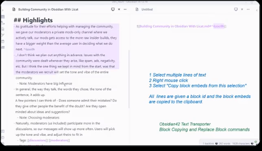
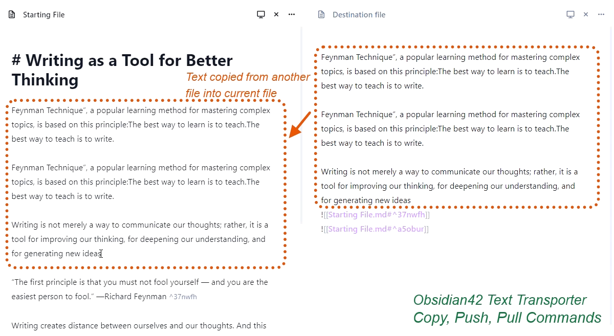
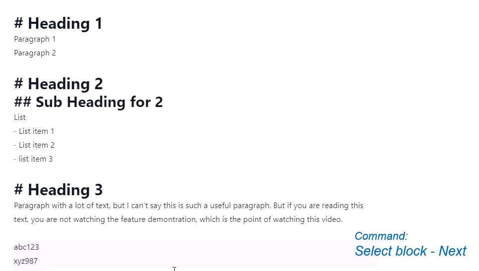
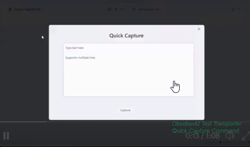

# Text Transporter - advanced text management for Obsidian
Text Transporter is the Swiss Army Knife of text manipulation plugins for Obsidian that allows you to modify contents of files in your vault, even when the file is not visible. In addition Text Transporter provides a number of convenient functions for quickly selecting lines, blocks and more, along with quickly creating block references.

Text Transporter will make you a text ninja!  Text Transporter is made with extra heart for keyboard lovers!

Text Transporter is part of the Obsidian42 family of Obsidian plugins. Check out the others:
- [Jump-to-Date](https://github.com/TfTHacker/obsidian42-jump-to-date) - Jump to a date via a convenient popup.
- [WordNet Dictionary](https://github.com/TfTHacker/Obsidian-WordNet) - WordNet is a large lexical database of English.

## Block Reference Commands
-  Copy block embeds from selection and Copy them to clipboard
-  Copy block embeds as aliases 
-  Replace a link with its original text (via context menu or CP All Commands)
-  Replace a link with its original text and alias (via context menu or CP All Commands)

 Click image for video demo!

## Transporter Commands - Copy, Push, Pull 
-  Copy line/selection to another file
-  Push line/selection to another file
-  Push line/selection to another file as Block Ref
-  Copy line(s) from another file
-  Pull line(s) from another file
-  Pull line(s) from another file as block references
-  Modifier keys in the file suggester
    - Press Ctrl (or Meta key) when clicking on an item and when the transport command is performed, the target file will be opened 
    - Press Shift when clicking on a bookmark will continue the suggester process into selecting lines from the target file, but the first line will be based on the bookmark location 

 Click image for video demo!

Note: These commands appear in the context menu when you right mouse click on a line in a file that is being edited. These commands can be toggled off in settings.

## Selection commands
-  Select current line and expand to block
-  Select block - previous
-  Select block - next
-  Select current line and expand up into previous block
-  Select current line and expand down into next block

 Click image for video demo!

# Quick Capture
- Opens a form where you can type in text and then quickly capture it to a file in your vault. The Quick Capture screen accepts enters for new lines. Ctrl+Enter will click the capture button.

 Click image for video demo!

## Bookmarks
- Bookmarks are shortcuts to files in your vault. You can have multiple bookmarks defined in settings.
- See this page for more details: [Bookmarks help](README-Bookmarks.md)

# Manual installation 
- Go to the releases page of this repository and find the most current release. [Link for releases](https://github.com/TfTHacker/obsidian42-text-transporter/releases)
- Download the 3 files main.js, manifest.json, and styles.css at the bottom of the release page.
- Open your Obsidian Vault folder location on your computer (however you normally do with your Operating System)
- You should see a folder in your vault called .obsidian ... open that ... and then open the plugins folder within it. (Obsidian Vault\.obsidian\plugins)
- Create a new folder within this plugins folder and name it whatever you want. Something like "obsidian-text-transporter" for example.
- Copy the files that you downloaded into this new "obsidian-text-transporter" plugin folder.
- Open Obsidian and go to Settings > Community Plugins ... Turn OFF Safe Mode if it is currently on
- You then will see a section called "Installed plugins". Click the refresh button to the right.
- This plugin should now show up. Now simply Enable it with the toggle to the right of it.

# Credits
I want to give thanks to these great projects, as in some way they are used by this plugin:
- github.com/chhoumann/quickadd/
- https://github.com/liamcain/obsidian-daily-notes-interface
